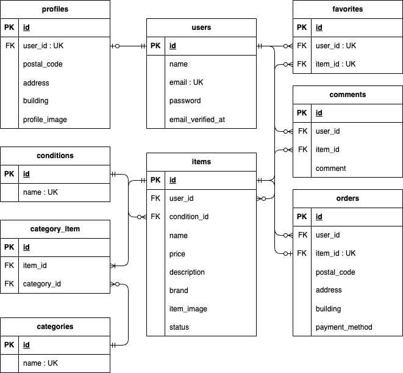

## アプリケーション名
# coachtechフリマアプリ

## 概要
実践学習ターム 模擬案件初級 フリマアプリ


## 主な機能
- **認証**: 新規ユーザ登録（メール認証）、ログイン/ログアウト
- **商品一覧**: 商品一覧表示、キーワード検索
- **商品詳細**: 詳細情報表示、購入機能（Stripe連携）
- **商品出品**: 商品画像アップロード、商品名・説明・価格の設定
- **マイページ**: プロフィール確認、出品・購入履歴の一覧表示
- **プロフィール編集**: ユーザ情報、プロフィール画像の変更


## 環境構築
```bash
# 1.リポジトリの取得
git clone git@github.com:izumiyukari/coachtech-flea-market.git
cd coachtech-flea-market

# 2.Dockerのビルド・起動
docker-compose up -d --build

# ３.Laravelの初期設定（PHPコンテナ内に入って実行）
docker-compose exec php bash

# ---以降はコンテナ内での操作 ---
# パッケージのインストール
composer install

# 環境設定ファイルの作成
cp .env.example .env
php artisan key:generate

# マイグレーション実行
php artisan migrate

# シーディング実行
php artisan db:seed
```


## テスト環境構築
```bash
# 1.テスト用のDBを作成（SSL無効化） ※password：root
mysql -h mysql -u root -p --ssl=0 -e "CREATE DATABASE IF NOT EXISTS testing;"

# 2.設定キャッシュをクリア
php artisan config:clear

# 3.テスト用DBのマイグレーションとSeed実行
php artisan migrate:fresh --seed --env=testing

# 4.テストの実行
php artisan test
```


## 開発環境URL
- **[phpMyAdmin]** [http://localhost:8080](http://localhost:8080)
- **[商品一覧画面]** [http://localhost/](http://localhost/)
- **[ユーザ登録]** [http://localhost/register](http://localhost/register)
- **[ログイン]** [http://localhost/login](http://localhost/login)

※プロフィール画面(/mypage)・商品出品画面(/sell)はログイン後にアクセス可能です。


## 使用技術（実行環境）
- Language : PHP 8.1
- Framework : Laravel 8.83.29
- Database : MySQL 8.0.26
- Web Server: Nginx 1.21.1
- Tool/Library:
    ・Laravel Fortify(認証)
    ・Mailtrap（メール送信テスト）
    ・fortify Stripe PHP SDK(決済処理)
    ・Docker/Docker Compose


## ER図



## 補足
・本アプリではプロフィール画像・商品画像をsrc/storage/app/pubic/ 配下に配置しています。
・対象ブラウザはChrome•Firefox•Safariの最新バージョンとし、旧ブラウザ対応は行わない。

・開発テスト用に下記ユーザ情報を1件作成してあります。
| 項目 | 内容 |
| :--- | :--- |
| **名前** | テスト太郎 |
| **メールアドレス** | `test1@example.com` |
| **パスワード** | `test1111` |
| **補足** | プロフィール情報（住所・画像等）が登録済みの状態です |